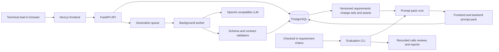

# Monoplanner Product Documentation

## Product purpose

Monoplanner manages coding-agent instructions as versioned project artifacts. A requirement change is decomposed into a business story and layer-specific changes, applied to product assets, and then converted into one frontend and one backend prompt. The prompts are generated together so shared API, validation, permission, nullability, pagination, and error rules can remain synchronized.

The product changes the current workflow in one concrete way: a technical lead no longer has to reconstruct two independent prompts after every requirement revision. Monoplanner retains the requirement history and related design state, then produces a reviewable prompt-pack version. The measured evidence concerns prompt synchronization; it does not establish faster delivery or better generated code.

## Persona

Alex is the technical lead of a SaaS team. The team uses coding agents for frontend and backend implementation and regularly changes validation, billing, permissions, and API behavior. Alex understands the system but loses time restating the same contract in two prompts and checking whether the prompts disagree. Alex uses Monoplanner to record a requirement change, review its affected layers, inspect the generated prompt pack, and export synchronized instructions to coding agents.

## Inputs and outputs

| Stage | Inputs | Outputs |
| --- | --- | --- |
| Project context | Product description, stack, conventions, constraints | Versioned project configuration |
| Requirement analysis | Raw requirement and prior requirement history | Structured business stories |
| Change planning | Selected story and current assets | Layer-specific change sets |
| Asset generation | Change set, previous asset version, related assets | Versioned UX, UI, frontend, API, backend, and database assets |
| Prompt-pack generation | Project context, story, change sets, old assets, new assets | Versioned frontend and backend implementation prompts |
| Evaluation | Requirement chains, contract facts, generated packs, human evidence labels | Coverage, evaluability, contradiction, and strict-success metrics |

## Architecture

The public product path is asynchronous. FastAPI validates and queues work, PostgreSQL provides durable state and worker coordination, and the worker performs LLM calls and stores versioned results. The evaluation path calls the same prompt-pack core without database cache lookup, which isolates each experimental unit.

## Module map

| Area | Repository location | Responsibility |
| --- | --- | --- |
| User interface | Separate `monoplanner-frontend` repository | Requirement entry, project navigation, asset review, prompt-pack display, export |
| HTTP API | `app/api/v1` | Authentication, validation, CRUD, generation requests, run status |
| Queue and workers | `app/services/generation_queue_service.py`, `app/workers` | Durable task claiming, heartbeat, retries, cancellation, execution |
| Orchestration | `app/services/*generation_service.py` | Business stories, change sets, versioned assets, and prompt packs |
| Prompt definitions | `app/prompts` | Task prompts and structured output schemas |
| Persistence | `app/models`, `app/crud`, `alembic` | PostgreSQL entities, queries, and migrations |
| Evaluation | `evals` | Dataset validation, recorded generation, blind review, scoring, replay |
| Evidence | `data`, `results` | Inputs, answers, provenance, raw calls, review labels, reports |

## Own and rent decisions

Monoplanner owns the workflow, versioned data model, task definitions, queue, validators, evaluation protocol, and user interface. It rents foundation-model inference through an OpenAI-compatible API because requirement interpretation and prompt writing are open-ended language tasks. Deterministic code handles state transitions, schema validation, retries, recording, fact coverage, and metric calculation. The final experiments used `openai/gpt-5-mini` at temperature `0.2` with at most two structured retries.

## Metrics

The preregistered target was for at least 90% of all planned units to be structurally valid, evaluable, free from frontend/backend contradictions, and free from common errors. A zero contradiction count is not sufficient when facts are missing or uncertain.

| Evidence release | Scope | Main result | Interpretation |
| --- | --- | --- | --- |
| v1 diagnostic test | 8 chains, 24 changes, 48 packs, 688 fact judgments | 27.08% strict success; 39.68% omission rate; 2 observed contradictions | The input and scoring protocol required hidden or inherited facts that neither method received. This result diagnosed a measurement problem and does not establish model quality. |
| v2.1 human-reviewed pilot | 2 chains, 6 changes, 12 packs, 82 fact judgments | 100% structural, marker, and exact-statement coverage; 98.78% semantic coverage; 91.67% overall strict success | The revised contract-fact protocol passed the overall target. The joint method reached 83.33%, below target, because one pack contained an uncertain optional implementation suggestion. |
| v2.2 automatic regression | Same 12-pack pilot | 100% structural, marker, and exact-statement coverage | The known optional-suggestion pattern disappeared. No new human review was performed, so semantic coverage and strict success are undefined. |

The final metric set reports structural validity, evaluability, explicit semantic coverage, strict success, observed contradictions, omissions, uncertainty, and common errors. `C_evaluable` counts deduplicated contradictions only in fully evaluable packs; `C_observed` retains contradictions found anywhere in the reviewed set.

## Limitations and responsible use

- The source context comes from one public full-stack repository.
- The refined v2 protocol covers two development chains and one model run per step.
- One reviewer supplied the semantic judgments, so inter-rater agreement is unknown.
- The deterministic rule baseline performed better than joint generation in v2.1. The present evidence does not show an advantage for the LLM method.
- The complete database-backed requirement-to-asset workflow was not evaluated because the supplied dataset lacks the necessary asset snapshots and change sets.
- Prompts can still be plausible but wrong. A developer must review them before using them to change software, especially for security-sensitive work.
- Recorded project context can contain confidential information. Production use requires access control, retention policy, redaction, and audit controls appropriate to the organization.

## Future path

The next evaluation should apply the v2 fact schema to the eight held-out chains, use sampled or two-stage review rather than repeating every fact after each prompt revision, and add a second reviewer for disagreement analysis. A later experiment can add authored asset snapshots and change sets to test the complete database-backed workflow. Repeated paired runs would then separate prompt-method effects from model variation. Product work should prioritize evidence traceability and review workflows before claiming productivity gains.
